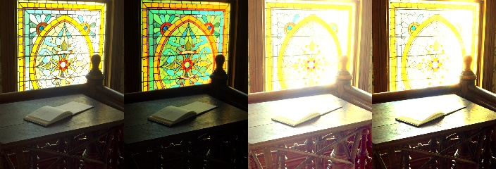

# HDR Tone Mapping

This project converts a high dynamic range (HDR) image into a standard dynamic range (SDR) image with three tone mapping operators. It then measures how close each result is to an SDR reference image with three metrics: PSNR, SSIM and CIEDE2000 colour difference. The operators are written from scratch in NumPy and follow the equations in the original papers, which are listed in the References section.

## Quick start

Requires Python 3.10 or newer. Run these commands from the project folder:

```
pip install -r requirements.txt
python main.py
```

The script prints a table of metrics and writes the tone mapped images to `results/`.

## Background

**HDR and SDR images.** Light levels in a real scene can differ by five orders of magnitude (a factor of 100,000) or more [4], for example between a sunlit window and a dark corner of the same room. An HDR image stores these levels as floating point numbers that are proportional to the amount of light in the scene. These are called linear values, and they have no fixed upper limit. A normal screen, and an 8 bit image file such as a PNG, can only show values from 0 to 1, stored as 256 levels per colour channel. This is called SDR.

**Tone mapping.** A tone mapping operator compresses HDR values into the range 0 to 1. It tries to keep the image looking natural and to keep detail in both the bright and the dark areas. The three operators in this project are global operators: each one applies a single curve to every pixel.

**Luminance.** Each operator works on the luminance Y (the brightness) of each pixel, computed from its linear R, G and B values:

```
Y = 0.2126 R + 0.7152 G + 0.0722 B
```

These are the Rec. 709 weights [1]. They are the right weights for `Desk.exr` because the file has no `chromaticities` attribute, so the OpenEXR default applies: Rec. 709 primaries with a D65 white point, the same as sRGB.

**Log average luminance.** Reinhard and Drago both need one number that describes the overall brightness of the scene. They use the log average luminance, which is the geometric mean:

```
L_avg = exp(mean(log(delta + Y)))
```

delta = 0.000001 avoids log(0) for black pixels. Unlike the ordinary mean, the log average is not dominated by a few very bright pixels, such as a window or a lamp. This is Equation 1 of Reinhard et al. [2]. The printed equation places the 1/N of the mean outside the exp; the geometric mean needs it inside, which is what the code does.

**Keeping the colour.** Each operator computes a new display luminance L_d for every pixel. The R, G and B values of the pixel are then all multiplied by L_d / Y. Because all three channels are multiplied by the same number, the ratios between them stay the same, so the hue and saturation of the pixel do not change. A very saturated pixel can end up with one channel above 1; that channel is clipped to 1.

**Display encoding (sRGB).** The operators produce linear values, but screens and image files expect values encoded with the sRGB transfer function [3]:

```
V = 12.92 L                    if L <= 0.0031308
V = 1.055 L^(1/2.4) - 0.055    otherwise
```

The reference PNG is sRGB encoded (it contains an sRGB IEC61966-2.1 colour profile), and the Delta E calculation expects sRGB input. For this reason every result is sRGB encoded before it is evaluated or saved. Linear values shown without this step look far too dark.

## What main.py does

1. Loads `images/Desk.exr` as linear RGB. The file contains some small negative values (down to about -0.012), which HDR files can contain because of noise or colours outside the RGB gamut. They are set to 0, because negative light has no physical meaning and would make the logarithms undefined.
2. Loads `images/Desk_sdr.png` as the reference.
3. For each operator:
   1. tone maps the HDR image to linear display values from 0 to 1,
   2. encodes them with sRGB,
   3. rounds them to 8 bits, so the metrics describe exactly the image that is saved,
   4. computes PSNR, SSIM and Delta E 2000 against the reference and prints them,
   5. saves the image to `results/`.
4. Saves `results/comparison.jpg`, which shows the reference and the three results side by side at half size.

## Files

| File | Contents |
|---|---|
| `main.py` | Runs the comparison and prints the results table. |
| `tone_mapping_algorithms.py` | The three tone mapping operators and their shared helper functions. |
| `evaluation_metrics.py` | PSNR, SSIM and Delta E 2000. |
| `image_io.py` | Loading HDR and SDR images, sRGB encoding, rounding to 8 bits and saving. |
| `requirements.txt` | The exact package versions used. |
| `images/` | The HDR input, the SDR reference and the licence of the HDR input. |
| `results/` | The images written by `main.py`. |

## Tone mapping operators

Symbols: L_w is the world (scene) luminance of a pixel and L_d is its display luminance, from 0 to 1. `log` is the natural logarithm and `log10` is the base 10 logarithm.

### 1. Reinhard (`reinhard_tone_mapping`)

The global operator from "Photographic Tone Reproduction for Digital Images" by Reinhard, Stark, Shirley and Ferwerda [2]. It is based on how photographers choose an exposure.

```
L   = (a / L_avg) * L_w      (Equation 2)
L_d = L / (1 + L)            (Equation 3)
```

Equation 2 sets the exposure so that the log average luminance is mapped to the key value a. Equation 3 then compresses the result: dark values are almost unchanged, while bright values are divided by about L, so they get close to 1 but never reach it.

| Parameter | Value | Meaning |
|---|---|---|
| `key` (a) | 0.18 | Middle grey, the value the paper uses for a normal scene. The paper suggests values from 0.045 (darker) to 0.72 (brighter). |

The paper also gives Equation 4, which lets the brightest values burn out to white, and a local version with automatic dodging and burning. This project implements only the simple global operator of Equation 3.

### 2. Drago (`drago_tone_mapping`)

The operator from "Adaptive Logarithmic Mapping For Displaying High Contrast Scenes" by Drago, Myszkowski, Annen and Chiba [4]. Human perception of brightness is roughly logarithmic, so this operator compresses luminance with a logarithm. Its main idea is to change the base of the logarithm from pixel to pixel. The darkest pixels use base 2, which keeps contrast in the shadows. The brightest pixels use base 10, which compresses the highlights strongly.

First, each luminance is divided by the world adaptation luminance L_wa, which is the log average luminance (Section 3.3 of the paper). L_wmax is the largest luminance after this division. Then:

```
L_d = (L_dmax * 0.01 / log10(L_wmax + 1)) * log(L_w + 1) / log(2 + 8 * (L_w / L_wmax)^(log(b) / log(0.5)))      (Equation 4)
```

The term (L_w / L_wmax)^(log(b) / log(0.5)) is the bias function of Perlin and Hoffert [5] (Equation 3 of the paper). It goes from 0 for black pixels to 1 for the brightest pixel, so the base of the logarithm, 2 + 8 * bias, goes from 2 to 10. With L_dmax = 100 the brightest pixel is mapped to exactly 1.

| Parameter | Value | Meaning |
|---|---|---|
| `bias` (b) | 0.85 | The default proposed in the paper. The paper finds values from 0.7 to 0.9 the most useful. Smaller values give a brighter image with more detail in dark areas. |
| `max_display_luminance` (L_dmax) | 100 cd/m2 | The maximum display luminance used in the paper. |

Two more details from the paper. First, L_wa is divided by (1 + b - 0.85)^5 so that the overall brightness stays about the same when b changes; at the default b = 0.85 this factor is 1. Second, the paper proposes its own gamma curve based on ITU-R BT.709 (Section 4). That curve is not used here, so that all three operators get the same sRGB encoding and are compared on equal terms.

### 3. Logarithmic (`logarithmic_mapping`)

The basic logarithmic mapping that Drago et al. start from (Equation 1 of [4]). They present it following Stockham [6], who recommended a logarithmic relation between light and perceived brightness for image processing.

```
L_d = log(L_w + 1) / log(L_max + 1)
```

L_max is the largest luminance in the image, so the brightest pixel is mapped to 1 and all other values are compressed smoothly below it. Drago et al. note that this curve compresses luminance too much, so the image loses its impression of high contrast. Their adaptive operator above was designed to fix this. It is included here as a simple baseline with no parameters. Because it uses the luminance values exactly as they are stored in the file, its result depends on the scale of those values, unlike the other two operators.

## Evaluation metrics

All three are full reference metrics: each one compares a result with a reference image. They are computed with scikit-image on sRGB values from 0 to 1.

**PSNR** (peak signal to noise ratio, in decibels, higher is better):

```
MSE  = mean((reference - result)^2)    over all pixels and channels
PSNR = 10 * log10(1 / MSE)
```

PSNR measures pixel by pixel error. It does not model how people see images.

**SSIM** (structural similarity index, at most 1, higher is better), from Wang, Bovik, Sheikh and Simoncelli [7]. It compares the local brightness, contrast and structure of the two images in a small window that slides over every pixel, then averages the result over the image. The settings follow the paper: an 11 x 11 Gaussian window with a standard deviation of 1.5 pixels, K1 = 0.01 and K2 = 0.03. SSIM is computed for R, G and B separately and the three values are averaged. Wang et al. computed SSIM on the luminance channel only.

**Delta E 2000** (mean CIEDE2000 colour difference, lower is better, 0 means identical) [8, 9]. Both images are converted from sRGB to CIELAB with a D65 white point. CIELAB is a colour space designed so that equal distances look like roughly equal colour differences. The CIEDE2000 difference is computed for every pixel and averaged over the image.

## Test images

* `images/Desk.exr` is the HDR input, 644 x 874 pixels. It comes from the OpenEXR sample images (`ScanLines/Desk.exr` in the openexr-images repository [10]) and is byte for byte identical to the file there. It shows a desk with an open book in front of a bright stained glass window. Its brightest pixel is about 750 times brighter than its log average luminance.
* `images/Desk_sdr.png` is the SDR reference, 644 x 874 pixels, sRGB. It was made by converting `Desk.exr` to an 8 bit PNG. The tool and settings used for the conversion were not recorded, so the tone mapping that the conversion applied is unknown. It is not the preview image published with the sample (`ScanLines/Desk.jpg`).

## Results

Output of `python main.py`:

| Operator | PSNR (dB) | SSIM | Delta E 2000 |
|---|---|---|---|
| Reinhard | **20.10** | **0.860** | **7.86** |
| Drago | 17.56 | 0.767 | 11.09 |
| Logarithmic | 15.63 | 0.828 | 10.79 |



From left to right: SDR reference, Reinhard, Drago, Logarithmic.

## Findings

* **Reinhard** is the closest to the reference on all three metrics. Its window has a similar brightness to the reference and keeps the colours of the glass, although the glass colours are more saturated than in the reference. Its desk and shadows are slightly brighter than in the reference, but still the closest of the three.
* **Drago** gives the brightest image. Its base 2 logarithm in dark areas lifts the desk and shadows well above the reference, which is where it differs most from the reference. Its window is slightly darker than in the reference.
* **Logarithmic** gives the darkest image. As Drago et al. describe for this curve, it compresses luminance strongly: mapping the single brightest pixel to white pushes the rest of the image down. It has the lowest PSNR, because PSNR punishes an overall brightness difference heavily. Its SSIM and Delta E are still better than Drago's. SSIM compares local brightness with a relative measure that Wang et al. describe as consistent with Weber's law [7], so a moderate overall brightness change lowers it much less than it lowers PSNR.
* The metrics do not agree on the order of Drago and Logarithmic: Drago is better on PSNR, Logarithmic on SSIM and Delta E. This shows that the metrics measure different things, which is why all three are reported.

## Limitations

* The metrics measure similarity to one particular SDR image, made with an unrecorded conversion. There is no single correct SDR version of an HDR image, so a worse score means "less like this reference", not necessarily "worse image". For example, Drago lifts the shadows on purpose, and that is exactly what moves it away from this reference.
* Only one test image is used, so the results may not hold for other scenes.
* All three operators are global. Local operators, such as the bilateral filter method of Durand and Dorsey [11] or the dodging and burning version of Reinhard [2], usually keep more local detail.
* SSIM is averaged over R, G and B instead of being computed on luminance as in the original paper.
* The Drago operator uses the sRGB curve instead of the gamma curve proposed in its paper.

## Possible improvements

* Use a metric designed for tone mapping that compares the result with the HDR image itself instead of an SDR reference, such as TMQI [12].
* Test on more HDR images, for example the rest of the OpenEXR sample images.
* Add a local operator.
* Make the reference image with a documented method.

## References

1. Recommendation ITU-R BT.709-6. Parameter values for the HDTV standards for production and international programme exchange. International Telecommunication Union, 2015. https://www.itu.int/rec/R-REC-BT.709
2. E. Reinhard, M. Stark, P. Shirley and J. Ferwerda. Photographic Tone Reproduction for Digital Images. ACM Transactions on Graphics, 21(3), 267-276, 2002. https://doi.org/10.1145/566654.566575
3. IEC 61966-2-1:1999. Multimedia systems and equipment. Colour measurement and management. Part 2-1: Colour management. Default RGB colour space. sRGB. International Electrotechnical Commission, 1999. https://webstore.iec.ch/en/publication/6169
4. F. Drago, K. Myszkowski, T. Annen and N. Chiba. Adaptive Logarithmic Mapping For Displaying High Contrast Scenes. Computer Graphics Forum, 22(3), 419-426, 2003. https://doi.org/10.1111/1467-8659.00689
5. K. Perlin and E. M. Hoffert. Hypertexture. ACM SIGGRAPH Computer Graphics, 23(3), 253-262, 1989. https://doi.org/10.1145/74334.74359
6. T. G. Stockham. Image Processing in the Context of a Visual Model. Proceedings of the IEEE, 60(7), 828-842, 1972. https://doi.org/10.1109/PROC.1972.8782
7. Z. Wang, A. C. Bovik, H. R. Sheikh and E. P. Simoncelli. Image Quality Assessment: From Error Visibility to Structural Similarity. IEEE Transactions on Image Processing, 13(4), 600-612, 2004. https://doi.org/10.1109/TIP.2003.819861
8. M. R. Luo, G. Cui and B. Rigg. The Development of the CIE 2000 Colour-Difference Formula: CIEDE2000. Color Research and Application, 26(5), 340-350, 2001. https://doi.org/10.1002/col.1049
9. G. Sharma, W. Wu and E. N. Dalal. The CIEDE2000 Color-Difference Formula: Implementation Notes, Supplementary Test Data, and Mathematical Observations. Color Research and Application, 30(1), 21-30, 2005. https://doi.org/10.1002/col.20070
10. Academy Software Foundation. openexr-images: Collection of images associated with the OpenEXR distribution. https://github.com/AcademySoftwareFoundation/openexr-images
11. F. Durand and J. Dorsey. Fast Bilateral Filtering for the Display of High-Dynamic-Range Images. ACM Transactions on Graphics, 21(3), 257-266, 2002. https://doi.org/10.1145/566654.566574
12. H. Yeganeh and Z. Wang. Objective Quality Assessment of Tone-Mapped Images. IEEE Transactions on Image Processing, 22(2), 657-667, 2013. https://doi.org/10.1109/TIP.2012.2221725

## Credits

`images/Desk.exr` is Copyright (c) 2004 Industrial Light & Magic, a division of Lucasfilm Entertainment Company Ltd. It is distributed in the openexr-images repository [10] under the BSD 3 Clause licence, which is included in `images/Desk_exr_LICENSE.txt`.
